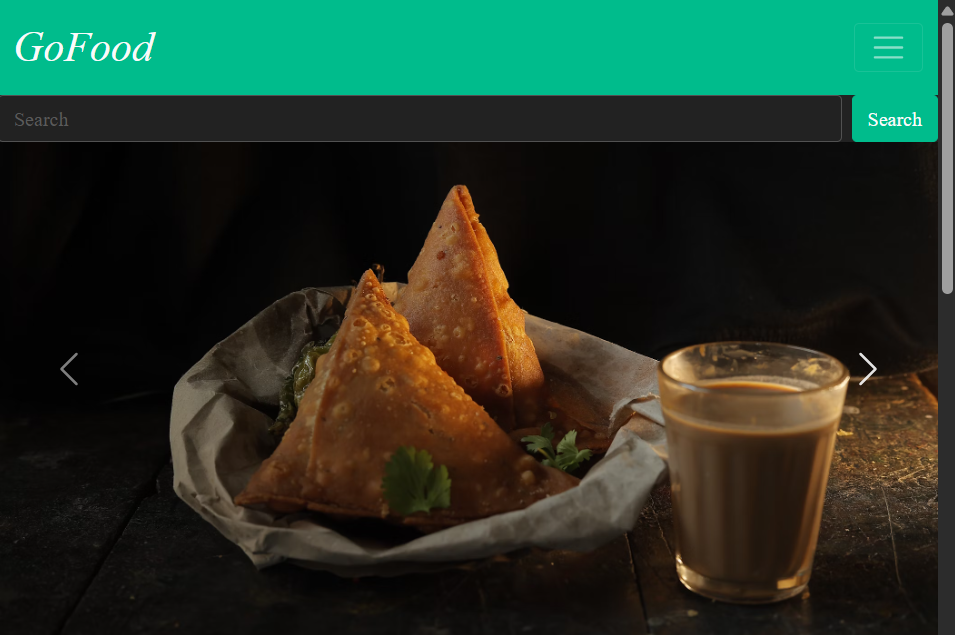
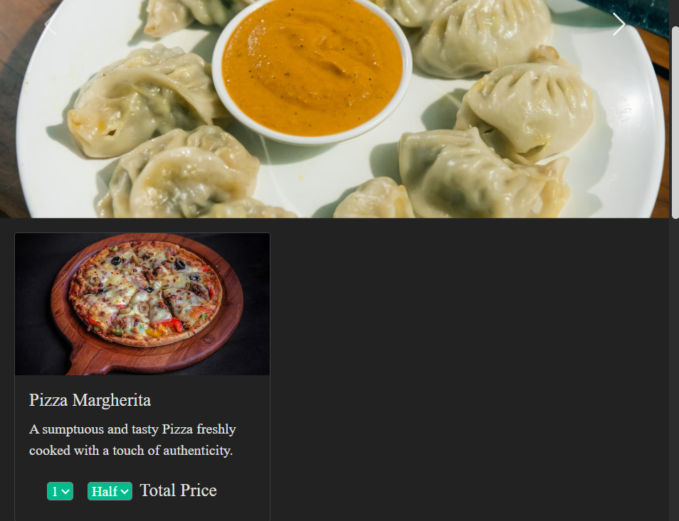
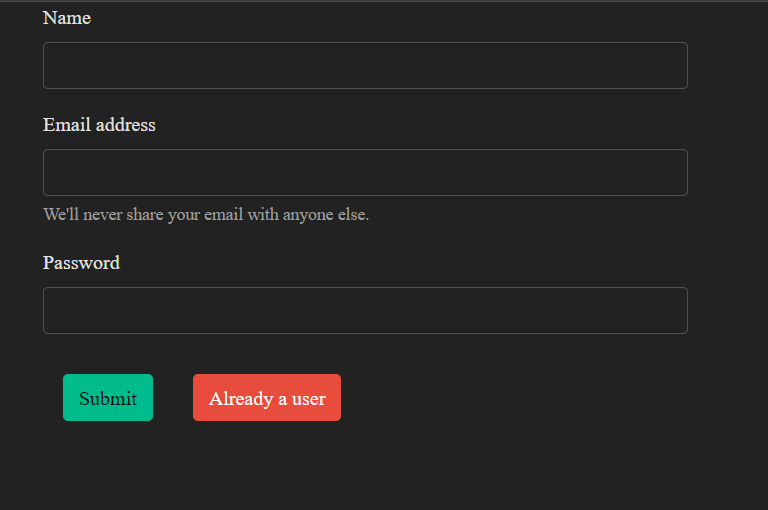

# 🍔 GoFood - Online Food Ordering App

GoFood is a modern web application that lets users explore menus, order delicious food, intended to let them enjoy a smooth online food delivery experience — all from the comfort of their browser.

## 🚀 Features
- 🔐 Sign Up and Login
- 🔎 Browse through various food items, sort based on categories or search based on keywords.
- 🛒📦📊 Keep track of the items in cart and your order history

## 🖼️ App Screenshots

### 🔻 Home Page- Carousel

### 🔻 Item Card for each Food Item available on the platform

### 🔻 Simple user-friendly Navigation Bar

### 🔻 SignUp page

---

> 🎨 Built using React, Node.js, MongoDB Atlas, and Express – delivering a full-stack experience for foodies and developers alike.

